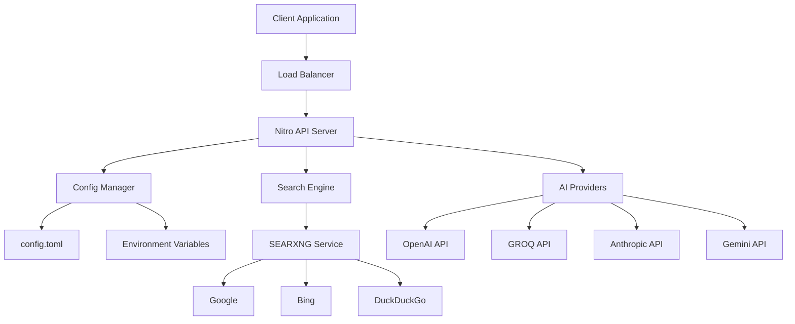
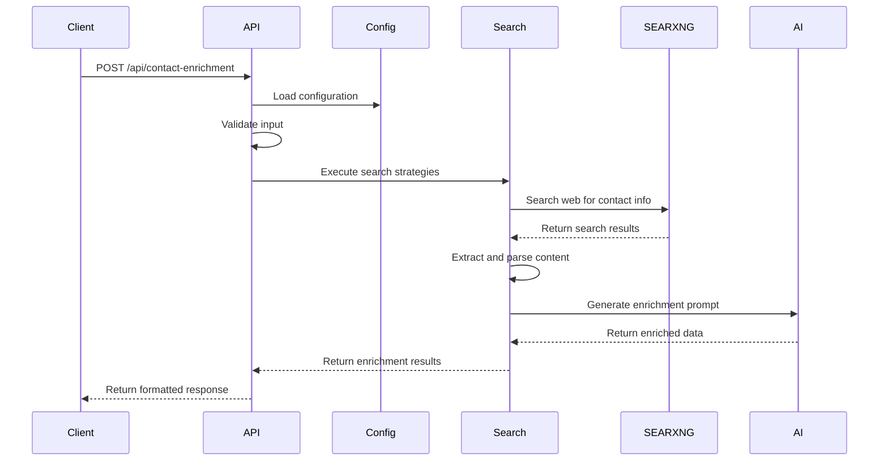
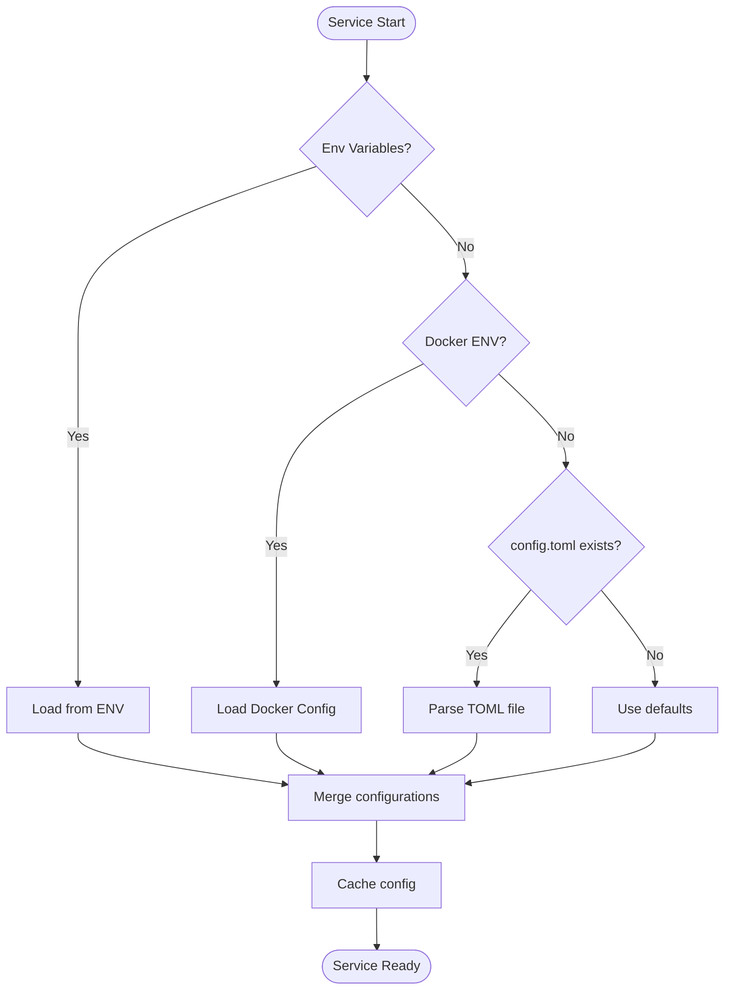

# 🏗️ Contact Enrichment Service - Architecture Documentation

This document provides a deep dive into the technical architecture of the Contact Enrichment Service.

## 📊 System Architecture

### High-Level Overview



### Component Architecture

#### 1. API Layer (Nitro Framework)
```typescript
// Request Flow
Request → Nitro Router → Validation → Business Logic → Response

// File Structure
server/
├── api/
│   ├── contact-enrichment.post.ts  # Main endpoint
│   └── health.get.ts               # Health checks
└── routes/
    └── index.get.ts                # Documentation
```

#### 2. Business Logic Layer
```typescript
// Core Components
lib/
├── config.ts      # Configuration management
├── providers.ts   # AI model providers
└── search.ts      # Search orchestration
```

#### 3. External Services
- **SEARXNG**: Open-source metasearch engine
- **AI Providers**: Multiple LLM APIs
- **Web Sources**: LinkedIn, GitHub, company websites

## 🔧 Technical Stack

### Core Technologies

| Component | Technology | Version | Purpose |
|-----------|------------|---------|---------|
| **Runtime** | Node.js | 18+ | JavaScript execution |
| **Framework** | Nitro | 2.x | Universal server framework |
| **Language** | TypeScript | 5.x | Type-safe development |
| **AI Integration** | LangChain | 0.x | Multi-provider AI interface |
| **Search Engine** | SEARXNG | Latest | Privacy-focused search |
| **Container** | Docker | 20+ | Containerization |
| **Orchestration** | Docker Compose | 2.x | Multi-service management |

### Dependencies

#### Production Dependencies
```json
{
  "@langchain/anthropic": "^0.1.0",
  "@langchain/google-genai": "^0.0.0",
  "@langchain/groq": "^0.0.0",
  "@langchain/openai": "^0.0.0",
  "@langchain/ollama": "^0.0.0",
  "@iarna/toml": "^2.0.0",
  "axios": "^1.6.0",
  "cheerio": "^1.0.0",
  "nitropack": "^2.8.0"
}
```

#### Development Dependencies
```json
{
  "@types/node": "^20.0.0",
  "typescript": "^5.0.0"
}
```

## 🧩 Module Architecture

### Configuration Module (`lib/config.ts`)

```typescript
interface Config {
  GENERAL: GeneralConfig;
  MODELS: ModelConfigs;
  API_ENDPOINTS: ApiEndpoints;
}

// Configuration Sources (Priority Order)
1. Environment Variables
2. Docker Environment
3. config.toml File
4. Default Values
```

**Key Features:**
- TOML file parsing
- Environment variable override
- Docker-aware configuration
- Caching for performance

### Providers Module (`lib/providers.ts`)

```typescript
interface ModelProvider {
  [modelName: string]: {
    model: BaseChatModel;
    embeddings?: Embeddings;
  };
}

// Supported Providers
- OpenAI (GPT-3.5, GPT-4, GPT-4-turbo)
- GROQ (Llama models, Mixtral)
- Anthropic (Claude-3 variants)
- Gemini (Gemini-Pro, Gemini-1.5)
- Ollama (Local models)
- Custom OpenAI-compatible endpoints
```

**Key Features:**
- Dynamic provider loading
- Conditional initialization (based on API keys)
- Model capability detection
- Error handling and fallbacks

### Search Module (`lib/search.ts`)

```typescript
interface SearchStrategy {
  name: string;
  execute: (contact: ContactInfo) => Promise<SearchResult[]>;
  confidence: number;
}

// Search Strategies
1. Name + Company search
2. Email domain search
3. LinkedIn profile search
4. GitHub profile search
5. Company website search
```

**Key Features:**
- Multi-source search orchestration
- Content extraction and parsing
- Result aggregation and deduplication
- Confidence scoring
- Source attribution

## 🔄 Data Flow

### Contact Enrichment Flow



### Configuration Loading Flow



## 🔍 Search Architecture

### SEARXNG Integration

```yaml
# SEARXNG Configuration
searxng:
  engines:
    - google
    - bing
    - duckduckgo
    - wikipedia
    - wolframalpha
  formats:
    - json
  rate_limiting:
    enabled: true
    requests_per_minute: 60
```

### Search Result Processing

```typescript
interface SearchResult {
  url: string;
  title: string;
  content: string;
  source: string;
  confidence: number;
  timestamp: Date;
}

// Processing Pipeline
Raw SEARXNG Results → 
Filter & Deduplicate → 
Content Extraction → 
Relevance Scoring → 
Final Results
```

### Content Extraction

```typescript
// Supported Content Types
1. HTML Pages (Cheerio parsing)
2. JSON APIs (Direct parsing)
3. Social Media (Meta tag extraction)
4. Professional Networks (Structured data)

// Extraction Strategies
- Meta tags (og:, twitter:, linkedin:)
- Structured data (JSON-LD, microdata)
- Content selectors (CSS, XPath)
- Text analysis (NLP, regex)
```

## 🤖 AI Integration Architecture

### Multi-Provider Strategy

```typescript
interface AIProvider {
  name: string;
  models: string[];
  capabilities: string[];
  rateLimits: RateLimit;
  costPerToken: number;
}

// Provider Selection Logic
1. Check API key availability
2. Validate model support
3. Consider rate limits
4. Factor in cost constraints
5. Apply user preferences
```

### Prompt Engineering

```typescript
interface EnrichmentPrompt {
  system: string;
  context: SearchResult[];
  contact: ContactInfo;
  instructions: string;
}

// Prompt Structure
System Role → 
Search Context → 
Original Contact → 
Enrichment Instructions → 
Output Format
```

### Response Processing

```typescript
interface AIResponse {
  enrichedContact: ContactInfo;
  confidenceScores: Record<string, number>;
  sources: Record<string, string>;
  reasoning: string;
}

// Processing Steps
1. Parse AI response (JSON)
2. Validate output format
3. Calculate confidence scores
4. Map sources to fields
5. Generate summary
```

## 🐳 Container Architecture

### Docker Compose Structure

```yaml
services:
  searxng:
    image: searxng/searxng:latest
    networks: [contact-enrichment-network]
    ports: ["4001:8080"]
    
  contact-enrichment:
    build: .
    depends_on: [searxng]
    networks: [contact-enrichment-network]
    ports: ["3001:3000"]
```

### Container Networking

```
┌─────────────────────────────────────┐
│        Docker Network              │
│   contact-enrichment-network       │
│                                     │
│  ┌─────────────┐  ┌──────────────┐ │
│  │   SEARXNG   │  │   API Server │ │
│  │   :8080     │  │    :3000     │ │
│  └─────────────┘  └──────────────┘ │
└─────────────────────────────────────┘
         │                    │
    localhost:4001      localhost:3001
```

### Health Check Architecture

```typescript
// Multi-Level Health Checks
1. Container Level (Docker)
2. Service Level (HTTP endpoints)
3. Dependency Level (SEARXNG, AI APIs)
4. Business Logic Level (End-to-end tests)

// Health Check Endpoints
GET /api/health → Service status
GET /api/health/deep → Full dependency check
GET /api/health/metrics → Performance metrics
```

## 📊 Performance Architecture

### Caching Strategy

```typescript
// Cache Layers
1. Configuration Cache (In-memory)
2. Search Results Cache (Redis - future)
3. AI Response Cache (Redis - future)
4. Provider Metadata Cache (In-memory)

// Cache Keys
config:v1
search:hash(query)
ai:hash(prompt)
provider:openai:models
```

### Rate Limiting

```typescript
// Rate Limiting Levels
1. SEARXNG Level (Built-in)
2. AI Provider Level (SDK)
3. Service Level (Future - Redis)
4. Client Level (Future - API keys)

// Limits
SEARXNG: 60 requests/minute
OpenAI: 3500 requests/minute
GROQ: 30 requests/minute
```

### Scaling Considerations

```yaml
# Horizontal Scaling
replicas: 3
strategy: round-robin
load_balancer: nginx

# Vertical Scaling
cpu: 2 cores
memory: 4GB
storage: 10GB

# Database Scaling (Future)
read_replicas: 2
connection_pool: 20
query_cache: enabled
```

## 🔒 Security Architecture

### API Security

```typescript
// Security Layers
1. Input Validation (Zod schemas)
2. Rate Limiting (Express middleware)
3. CORS Configuration (Nitro)
4. API Key Management (Environment)
5. Content Filtering (AI safety)
```

### Data Privacy

```typescript
// Privacy Measures
1. No persistent storage of contact data
2. Encrypted API communications (HTTPS)
3. Anonymized logging
4. SEARXNG privacy settings
5. AI provider data policies
```

### Container Security

```dockerfile
# Security Best Practices
- Non-root user
- Minimal base image (Alpine)
- Security scanning
- Read-only file system
- Resource limits
```

## 🚀 Deployment Architecture

### Environment Stages

```yaml
Development:
  searxng: docker-compose
  api: npm run dev
  config: local files
  
Staging:
  searxng: docker service
  api: docker service
  config: environment variables
  
Production:
  searxng: kubernetes pod
  api: kubernetes deployment
  config: secrets management
```

### Monitoring Architecture

```typescript
// Monitoring Stack (Future)
Metrics: Prometheus
Visualization: Grafana
Alerting: AlertManager
Logging: ELK Stack
Tracing: Jaeger

// Key Metrics
- Request rate
- Response time
- Error rate
- AI usage costs
- Search success rate
```

## 🔧 Extension Points

### Adding New AI Providers

```typescript
// Extension Interface
interface AIProviderPlugin {
  name: string;
  initialize(config: ProviderConfig): Promise<void>;
  createChatModel(modelName: string): BaseChatModel;
  createEmbeddings(modelName: string): Embeddings;
  getSupportedModels(): string[];
}
```

### Adding New Search Sources

```typescript
// Extension Interface
interface SearchSourcePlugin {
  name: string;
  search(query: string): Promise<SearchResult[]>;
  extractContent(url: string): Promise<string>;
  getConfidenceScore(result: SearchResult): number;
}
```

### Adding New Data Enrichers

```typescript
// Extension Interface
interface DataEnricherPlugin {
  name: string;
  enrich(contact: ContactInfo): Promise<ContactInfo>;
  getFieldSupport(): string[];
  getConfidenceScore(): number;
}
```

---

This architecture supports the current feature set while providing clear extension points for future enhancements. The modular design ensures maintainability and scalability as the service grows. 
